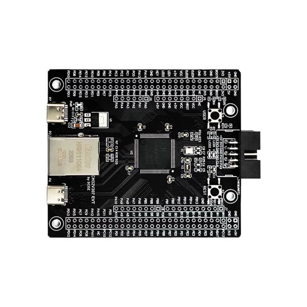

# CH32V307 EHCI debug bridge

Rust/Embassy firmware for using a CH32V307 as a coreboot EHCI debug dongle.

- USBHS (PB7/PB6) is the DUT-facing high-speed USB 2.0 device.
- EHCI debug transactions are limited to 8-byte packets; the debug class uses
  8-byte bulk endpoints and advertises them through `USB_DT_DEBUG`.
- Bridge backends:
  - `acm-bridge` (default): OTG_FS (PA12/PA11) presents a CDC-ACM serial port.
  - `tcp-bridge`: the devboard Ethernet PHY gets an address via DHCP and listens on TCP port `3333`.
  - Both can be enabled at once: DUT output is fanned out to ACM and TCP, while input from either backend is forwarded to the DUT.



## Build

Default CDC-ACM bridge:

```sh
nix develop
cargo build --release
```

CDC-ACM plus TCP bridge:

```sh
nix develop
cargo build --release --features tcp-bridge
```

TCP-only bridge:

```sh
nix develop
cargo build --release --no-default-features --features tcp-bridge
```

The release ELF is written to:

```text
target/riscv32imfc-unknown-none-elf/release/ch32v307-ehci-debug
```

## Flash

The cargo runner is configured for WCH-Link:

```sh
nix develop
cargo run --release
```

TCP-only build:

```sh
cargo run --release --no-default-features --features tcp-bridge
```

ACM plus TCP build:

```sh
cargo run --release --features tcp-bridge
```

## coreboot configuration

In coreboot's `src/drivers/usb/Kconfig`, select:

```text
Type of dongle -> USB gadget driver or Net20DC
CONFIG_USBDEBUG_DONGLE_STD=y
```

This firmware implements the standard USB 2.0 EHCI debug device path: coreboot
probes it with `GET_DESCRIPTOR(USB_DT_DEBUG)`, enables it with
`SET_FEATURE(USB_DEVICE_DEBUG_MODE)`, then uses the advertised bulk IN/OUT debug
endpoint addresses for 8-byte debug transactions. Do not select the FTDI FT232H
or WCH CH347 dongle options; those are for UART bridge chips with
vendor-specific setup requests, not for this firmware.

`USBDEBUG_DONGLE_STD` is coreboot's default dongle type. You still need the usual board-specific USB debug settings, such as `CONFIG_USBDEBUG=y`, the correct EHCI controller index, and possibly the debug port number.

## TCP usage

Flash a build with `tcp-bridge`, connect Ethernet, then connect to the DHCP-assigned address on port `3333`:

```sh
nc <board-ip> 3333
```

The TCP stream is a raw bidirectional byte bridge to coreboot's EHCI debug console. Only one TCP client is accepted at a time; reconnecting starts a new bridge session. In the combined ACM+TCP build, DUT output is broadcast with `embassy_sync::pubsub::PubSubChannel::publish_immediate()`, so an inactive backend does not stall the other one. If the output queue is full, the oldest queued byte is discarded to make room for the newest byte; subscribers skip lagged data with `next_message_pure()`.

## Notes

The `embassy-usb` change that lets class handlers answer
`GET_DESCRIPTOR(USB_DT_DEBUG)` and `SET_FEATURE(USB_DEVICE_DEBUG_MODE)` is
upstream in [embassy-rs/embassy#6408](https://github.com/embassy-rs/embassy/pull/6408).
No `embassy-usb` release contains it yet, so `[patch.crates-io]` tracks embassy
`main` until one does.

The `ch32-hal` USB fixes this firmware needs — reserve endpoint 0 for control
transfers (otherwise CDC-ACM can accidentally allocate data endpoints 0/0x80 and
Linux may drop the ACM device when the tty is opened), arm OUT endpoints as soon
as a configuration enables them (coreboot sends a probe write immediately after
configuring the EHCI debug device), and wake endpoint tasks on reset — are
proposed upstream as [ch32-rs/ch32-hal#189](https://github.com/ch32-rs/ch32-hal/pull/189).
Until that merges, `ch32-hal` comes from the local `../ch32-hal` checkout that
carries those fixes.

The current `ch32-hal` USBHS driver cannot allocate the same endpoint index for
both directions, so this firmware advertises debug OUT endpoint 1 and debug IN
endpoint 2. coreboot reads those addresses from the USB debug descriptor. The
bridge drops coreboot's initial `USB\r\n` probe write instead of forwarding it to
ACM/TCP clients, and the ACM backend waits for DTR before sending data to the
host tty.
